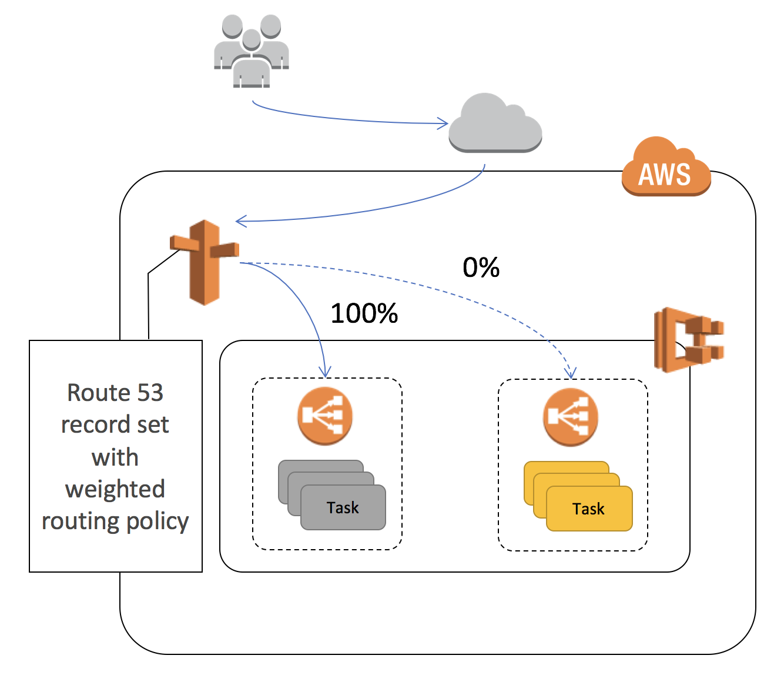
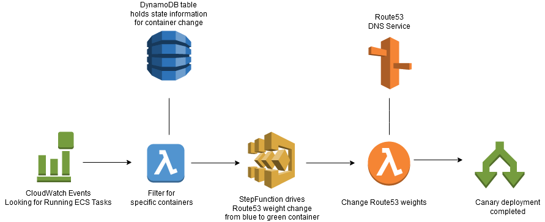
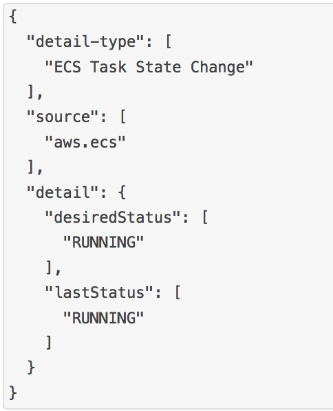
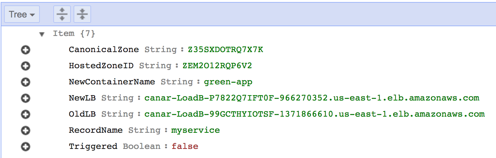
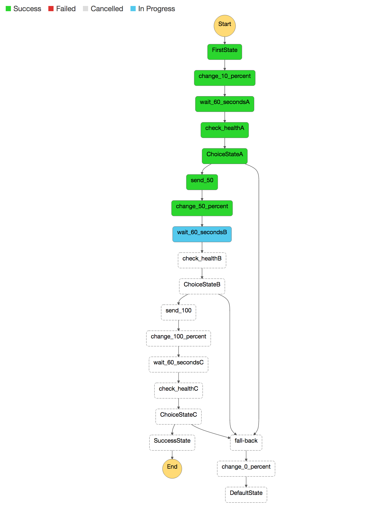

# Canary Blue/Green deployments on ECS

This reference architecture demonstrates how to execute a canary deployment for Elastic Container Service. 
In order to provide an automated and safe method of migrating traffic from a *blue* deployment
to a *green* one, this solution leverages Route53 weights to adjust the traffic flow from one ECS service to another.
We associate a new service with a separate Application Load Balancer, leveraging ECS Event Streams 
to trigger the deployment. Once triggered, [Step Functions](https://aws.amazon.com/step-functions/) handle 
the transitioning of traffic off of the *blue* ALB to the *green* one. If the Step Function detects a failure 
of the *green* service, it will automatically fail-back to the original configuration. 
This solution does not destroy the original service, so it does offer a safe and reliable method of transitioning 
traffic, including natural "connection-draining". Users will have to terminate their old *blue* infrastructure 
manually once the cut-over is complete.
The one concern users may have is that DNS propogation delay of approximately 60 seconds will be introduced 
between migration increments.



## Pre-Requisites
This example uses [AWS Command Line Interface](http://docs.aws.amazon.com/cli/latest/userguide/cli-chap-welcome.html) to run the steps below.

Please follow [instructions](http://docs.aws.amazon.com/cli/latest/userguide/installing.html) if you haven't installed AWS CLI. Your CLI [configuration](http://docs.aws.amazon.com/cli/latest/userguide/cli-chap-getting-started.html) need PowerUserAccess and IAMFullAccess [IAM policies](http://docs.aws.amazon.com/IAM/latest/UserGuide/access_policies.html) associated with your credentials.

Verify that your AWS CLI is installed and up to date.
```console
aws --version
```
## Get going by following these steps

#### 1. Create a new S3 bucket from which to deploy our source code (ensure that the bucket is created in the same AWS Region as your network and services will be deployed - which should be _us-east-1_):

```console
aws s3 mb s3://<MY_BUCKET_NAME>
```

#### 2. Clone this repo

```console
git clone https://github.com/nbrandaleone/canary-blog.git
```

#### 3. Copy all templates and scripts into your bucket
```console
aws s3 cp canary-setup.yaml s3://<MY_BUCKET_NAME>
aws s3 cp canary-deployment.yaml s3://<MY_BUCKET_NAME>
aws s3 cp --recursive templates s3://<MY_BUCKET_NAME>/templates
aws s3 cp --recursive lambdafunctions s3://<MY_BUCKET_NAME>/lambdafunctions
```

#### 4. Create the CloudFormation stack for base setup
```console
aws cloudformation deploy --stack-name <STACK_NAME. For example "canary-setup"> \
--template-file canary-setup.yaml --capabilities CAPABILITY_NAMED_IAM \
--region us-east-1 \
--parameter-overrides RecordSetName=<MY_SERVICE_NAME. For example "myservice"> \
HostedZoneName=<DOMAIN_NAME. For example "test.net."> TemplateBucket=<MY_BUCKET_NAME>
```

The first CloudFormation setup script will create a self-contained environment in which to test a canary 
blue-green deployment.
It also creates a Route53 Hosted Zone and subdomain, along with a running ECS service, which we will consider the *blue* service. 

Here are the inputs required to launch CloudFormation templates:
  * **S3 Bucket**: Enter S3 Bucket for storing your CloudFormation templates and scripts. This bucket must be in the same region where you wish to launch all the AWS resources created by this example. For now, this region should be <us-east-1>.
  * **CloudFormation Stack Name**: Enter CloudFormation Stack Name to create stacks. For example "canary-setup".
  * **HostedNameZone**: Your domain name. For example "test.net."
  * **RecordSetName**: Enter your sub-domain name. This will point at your Application Load Balancer, where your ECS Service will be registered. For example "myservice".

It will take about 15 minutes to create all the resource, so get a cup of coffee. When you return, check out your Route53 hosted zone.  You will have a new one, along with a new VPC and ECS instances plus a running task/service. If your DNS name and subdomain were valid, you can hit those addresses to see your *blue* container response. If not, you can simply watch things work by going to your ALB's directly and observing your StepFunction and Route53 records.

#### 5. Create the CloudFormation stack for green service deployment
```console
aws cloudformation deploy --stack-name <STACK_NAME. For example "canary-deployment"> \
--template-file canary-deployment.yaml --capabilities CAPABILITY_NAMED_IAM \
--region us-east-1 \
--parameter-overrides SetupStackName=<OLD_STACK_NAME. For example "canary-setup"> TemplateBucket=<MY_BUCKET_NAME>
```

The second CloudFormation template creates your *green* service. It also makes the resources that will look for your new
replacement container (*green-app*), and react accordingly. As soon as the template completes building, 
it will automatically trigger the canary deployment.

Here is the logical flow of how the solution works. We will discuss each component below.



The first component is [ECS Events](http://docs.aws.amazon.com/AmazonECS/latest/developerguide/ecs_cwe_events.html),
which tracks container or task changes. We are interested in being notified once a new task is _RUNNING_.
We tell [CloudWatch Events](http://docs.aws.amazon.com/AmazonCloudWatch/latest/events/WhatIsCloudWatchEvents.html)
to send notification to a Lambda function, which will discriminate the event stream, focusing only
on those relevant to our canary deployment.



This solution requires a DynamoDB table to maintain state, and to link your original *blue* service 
with its newer *green* service and pertinent related information.  
This is necessary since Amazon ECS Events can send events 
on an "at least once" basis; this means you may receive more than a single copy of a given event. 
Additionally, events may not be delivered to your event listeners in the order in which the events occurred. 
We will use a small table to keep track of state, so we do not trigger the process more than once. 
This DynamoDB table is called "CanaryTable".



A sample entry in the DynamoDB table looks like the above diagram. If you want to test out your own services, you will have to update the table AND update the lambda function (blue color in diagram) which filters the Event stream.

## Testing

Once the second CloudFormation script completes, the new *green* ECS service will be started within seconds.  
Monitor both the Route53 HostedZone screen, along with the StepFunction console. You will see the weights 
change slowly at first, and then faster.  The StepFunction has a GUI where you can visualize these changes.
If you want to test it again, do the following:
1. Reset your *Triggered* item in the DynamoDB table to "false", for the "green-app" index.
2. Stop your ECS task, which is associated with your *green-app* container. Once the ECS service notices it is dead, 
it will restart it.  This will re-trigger
the process, and you will notice the Route53 weights changing, and the StepFunction firing again.



## Cleaning Up

To clean-up delete the CloudFormation scripts in reverse order. You must delete the ALB records in the 
Route53 HostedZone manually, or you will get a "delete-failure".
Do not forget you delete your S3 bucket.


## To Do or known issues
* Make sure templates can work in all regions, not just us-east-1
* There is sometimes a race condition in reading/writing the *Triggered* key in the DynamoDB table
* Add better error catching in the StepFunction
* Create some automation around parameters, so users do not have to fill in the DynamoDB table

## Resources created in this exercise

Count | AWS resources 
| --- | --- |
7  | [AWS CloudFormation templates](https://aws.amazon.com/cloudformation/)
1  | [Amazon VPC](https://aws.amazon.com/vpc/) (192.168.10 and 20.0 / 24)   
1  | [AWS Step Functions](https://aws.amazon.com/step-functions/) 
1  | [Amazon S3 Bucket](https://aws.amazon.com/s3/) 
3  | [AWS Lambda](https://aws.amazon.com/lambda/) 
1  | [Amazon ECS Cluster](https://aws.amazon.com/ecs/) 
2  | [Amazon ECS Service](https://aws.amazon.com/ecs/)
1  | [ECS Event Stream for CloudWatch Events](http://docs.aws.amazon.com/AmazonECS/latest/developerguide/cloudwatch_event_stream.html) 
2  | [Application Load Balancer](https://aws.amazon.com/elasticloadbalancing/applicationloadbalancer/) 
2  | [Application Load Balancer Target Groups](https://aws.amazon.com/elasticloadbalancing/applicationloadbalancer/) 
1  | [Route53 Hosted Zone](https://aws.amazon.com/route53/)
1  | [DynamoDB Table](https://aws.amazon.com/dynamodb/)

## License

This reference architecture sample is [licensed](./LICENSE) under Apache 2.0.
